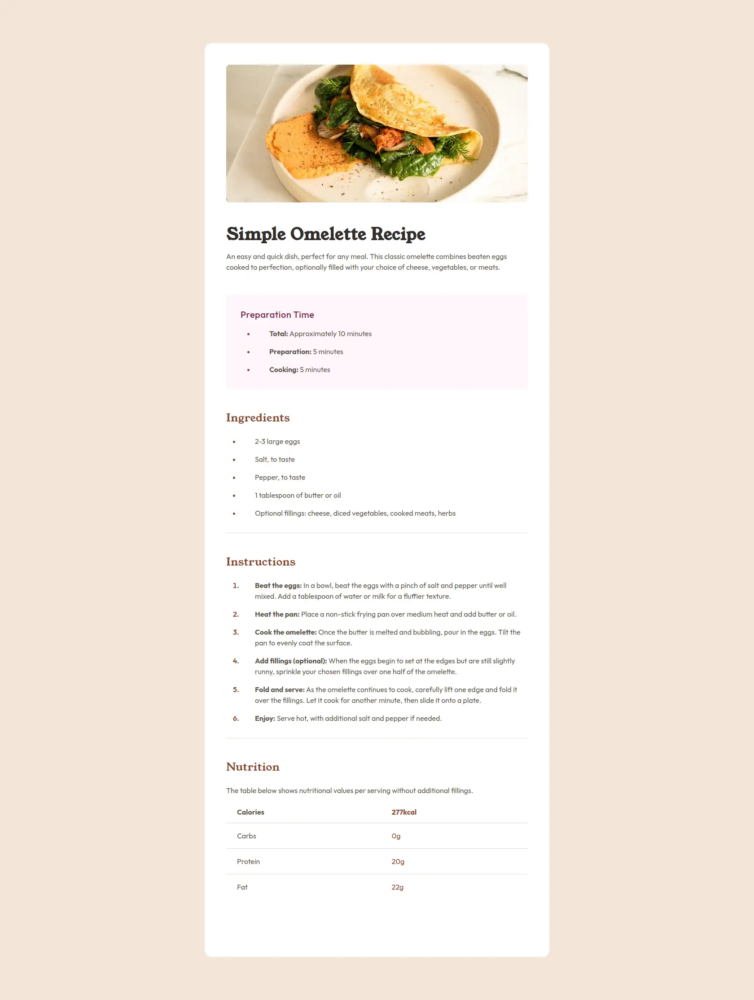

# Frontend Mentor - Recipe Page Solution

This is a solution to the [Recipe page challenge on Frontend Mentor](https://www.frontendmentor.io/challenges/recipe-page-KiTsR8QQKm). Frontend Mentor challenges help you improve your coding skills by building realistic projects.

## Table of Contents

- [Overview](#overview)
  - [Screenshot](#screenshot)
  - [Links](#links)
- [My Process](#my-process)
  - [Built With](#built-with)
  - [What I Learned](#what-i-learned)
  - [Continued Development](#continued-development)
  - [Useful Resources](#useful-resources)
- [Author](#author)
- [Acknowledgments](#acknowledgments)

## Overview

### Screenshot



### Links

- [Solution URL](https://github.com/wyasyn/recipe.git)
- [Live Site URL](https://omelette-recipe-frontend-mentor.netlify.app/)

## My Process

### Built With

- Semantic HTML5 markup
- CSS custom properties
- Mobile-first workflow
- [TailwindCSS v4](https://tailwindcss.com/) - Utility-first CSS framework

### What I Learned

Working on this project helped me improve my understanding of structuring semantic HTML and optimizing SEO metadata. I also enhanced my styling skills using TailwindCSS.

Here is an example of using `<figure>` and `<figcaption>` for better semantics:

```html
<figure>
  
  <figcaption>A simple and delicious omelette</figcaption>
</figure>
```

Using TailwindCSS utility classes for styling:

```css
.bg-rose-50 {
  background-color: #fff1f2;
}
```

### Continued Development

Going forward, I want to:

- Improve accessibility by adding ARIA attributes where necessary.
- Optimize image loading using Next.js' `next/image` component.
- Enhance performance by minimizing CSS and JavaScript bundle sizes.

### Useful Resources

- [MDN Web Docs](https://developer.mozilla.org/) - Great reference for HTML, CSS, and JavaScript best practices.
- [TailwindCSS Documentation](https://tailwindcss.com/docs) - Helped in structuring responsive styles efficiently.
- [Frontend Mentor](https://www.frontendmentor.io/) - Provided real-world project challenges to improve skills.

## Author

- Website - [Yasin Walum](https://yasin-walum.vercel.app)
- Frontend Mentor - [@wyasyn](https://www.frontendmentor.io/profile/wyasyn)
- Twitter - [@wyasyn](https://www.twitter.com/wyasyn)

## Acknowledgments

Special thanks to the Frontend Mentor community for their support and inspiration throughout this project.
